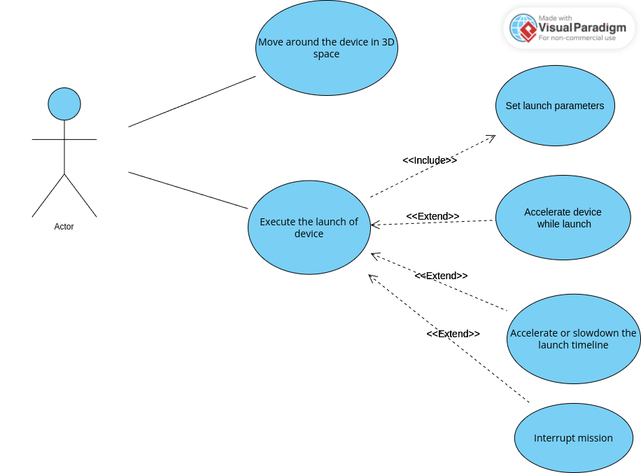

This project is designed to calculate the trajectories of spacecrafts in space missions
providing the users to dinamically change the trajectory of device: accelrating it in 3d, change the velocity in moment and track the trajectory.

Project launch is the following:
cmake -S . -B build
cmake --build build --target main
./build/main
After the commands choose the type of entering parameters of launch - console(default) or file input (in progress)
Type down the parameters of the space mission

